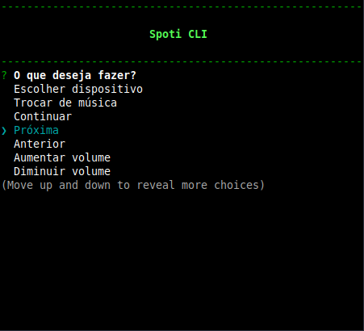

# Spotify Control CLI
Um controle remoto para spotify, em linha de comando.

## Roadmap
- [x] ~~Criar sistema para salvar o token/refresh token em cache~~
- [x] ~~Implementar refresh token~~
- [x] ~~Refatorar boa parte do código~~
- [x] ~~Melhorar interface do console~~
- [x] ~~Criar bot na twitch pra trocar de música~~
- [x] ~~Implementar modo de busca de música rápida~~

## Roadmap pra quando eu estiver com vontade
- [ ] Criar testes unitários (Jest)
- [ ] Colocar num container
